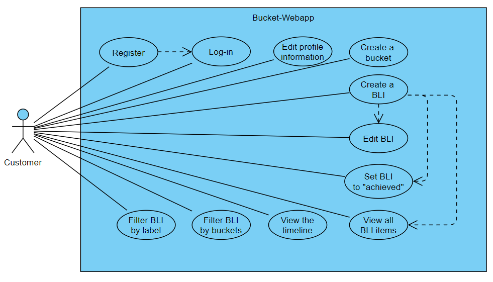
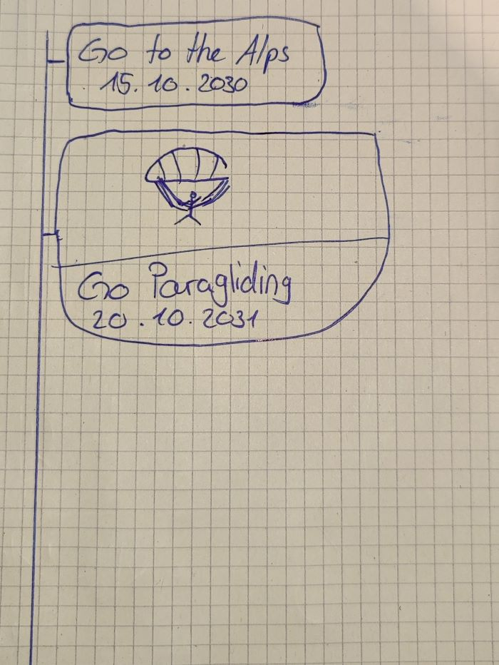

# bucket-webapp

#### Contents:
- [Analysis](#analysis)
  - [Scenario](#scenario)
  - [User Stories](#user-stories)
  - [Use Case](#use-case)
- [Design](#design)
  - [Prototype Design](#prototype-design)
  - [Domain Design](#domain-design)
  - [Business Logic Design](#business-logic-design)
  - [Endpoint Design](#endpoint-design)
- [Implementation](#implementation)
  - [Backend Technology](#backend-technology)
  - [Frontend Technology](#frontend-technology)
- [Deployment](#deployment)
- [User Guide](#user-guide)
- [Project Management](#project-management)
  - [Roles](#roles)
  - [Milestones](#milestones)

## Analysis

### Scenario
One of the first major decisions we made as a group was the idea of an application for our project work. We voted for the idea of making a Bucketlist application which was very unambiguously. The application allows a users to create an account where they can manage their personal Bucketlist items with their goals in the future. The CRM template provided by the lecturers served as basis of our program. We adjusted and changed the template accordingly to our visions to deliver a well designed result. We even went as far as creating a second repository dedicated to the front-end development. (https://github.com/mahgoh/bucket-frontend.git)

By determining our goal for the project we set up the scene for the next step which is the definition of user stories regarding the Bucketlist application.

### User Stories
1. As a [user], I want to have a Web app so that I can use it on different mobile devices and on desktop computers.
2. As a [user], I want to see a consistent visual appearance so that I can navigate easily, and it looks consistent.
3. As a [user], I want to use list views so that I can explore and read my business data.
4. As a [user], I want to use edit and create views so that I can maintain my data
5. As a [user], I want to create an account so that I can get access to the Web app.
6. As a [user], I want to log-in so that I can authenticate myself.
7. As a [user], I want to edit my profile so that my data is stored securely.

In addition to the minimal generic user stories, the following user stories were defined:
1.	As a [user], I want to view a timeline of achieved BLI so that I can get an overview of my past achievements.
2.	As a [user], I want to create, read, update, and delete BLI so that I can manage my bucket list.
3.	As a [user], I want to add different data to my BLI so that I can further personalize my BLI.
4.	As a [user], I want a dashboard as a list of categorized BLI so that I can get an overview of my BLI.
5.	As a [user], I want to create categories for my BLI so that I have my BLI organized.
6.	As a [user], I want a detailed view of BLI so that I can read up on the details.
7.	As a [user], I want to add a focus to my BLI so that I can see my prioritized BLI.

### Use Case / Fuctionalities

- UC-1 [Login on bucket-webapp]: Customers can log-in by entering an email address and password. As an extension, new customers may register first.
- UC-2 [Register on bucket-webappp]: Customers can register to get an account (profile) to access the bucket-webapp.
- UC-3 [Edit profile information]: Customers can edit their profile information, e.g. Email/password/name.
- UC-4 [Create a BLI]: Customers can create BLI. They can choose a title, description, date to accomplish, bucket, label, and an icon. These BLI can be edited/deleted[UC-5] and their status can be set to achieved[UC-6].
- UC-7-10: The BLI can be viewed in different views. A Customer can see all of the BLI at once / on the timeline / filtered by buckets / filtered by labels.

API
  •	Read bucket entries by filters (year, date, priority, ...)
    Limitations for first prototype: Social media aspect

## Design

### Prototype Design
After the Analysis we started with the prototype design. At first we only had the prototype design for the timeline and the dashboard. After the first designs were given we focused on the domain model and the business logic (including the API design). Simultaneously we started to code the website according to our designs. During this phase we also designed the profile page and the page to add a new item.
We used another repository for easier deployment of the prototypes (https://github.com/mahgoh/bucket-frontend.git)

The assets (HTML, CSS, JavaScript, image and font files) has been exported and will be extended in the later during implementation with jQuery, to build a dynamic website.

We used a method called brainwriting to gather ideas for certain designs of our interface. With this method the members of our group individually wrote down their ideas and presented them in a Microsoft Teams meeting to the team. The advantage of this method was that everyone of the team already had their ideas ready and thus we did not waste time to look for ideas but combined the presented ideas to create our design.
An example for the bucketlist timeline design written by hand:

An example for the dashboard design written by hand:

### Domain design

The bucket-webapp package contains the following domain objects / entities including getters and setters:

/ Domain model / (kann ich nicht finden)

### Business Logic Design

The bucket-webapp package contains classes of the following business services:

/ haben wir das?/

### Endpoint Design
/habe ich auch nicht gefunden /

## Implementation

After the work was done and the website was running like we wanted we had to implement the se-curity framework and deploy the finished website.

### Backend Technology

Tibor

### Frontend Technology

The visual appearance of the frontend was developed in a separate repository ([bucket-frontend](https://github.com/mahgoh/bucket-frontend)) with the usage of a custom component-based HTML bundler - written in [Go](https://go.dev/) specifically for this project. More about how the bundler works and how to use it is mentioned in the repository.

The power of utility classes in CSS, especially, when working in a team is incredible. We use [Tailwind CSS](https://tailwindcss.com/) to make use of this and ensure a great collaboration and maintainability in the future. During development, the Tailwind CSS Play CDN is used - a just-in-time CDN in the browser. Once completed with the design, the Tailwind CSS CLI is used to create a CSS bundle with only the used utility classes. The bundler does the same for the HTML files. These static files can then be integrated with the backend.

- [Custom HTML bundler](https://github.com/mahgoh/bucket-frontend)
- [Tailwind CSS](https://tailwindcss.com/)
- [JQuery](https://jquery.com/)

## Deployment

TODO: Deploy on Heroku  
TODO: Write section about deployment

## User Guide
TODO: Update URL once deployed  
This Web application can be accessed over the browser by using the following address: `https://bucket-frontend.netlify.app/index.html`.

## Project Management

### Roles
- Leader Backend: Tibor Haller
- Leader Frontend: Marco Kaufmann
- Frontend / Documentation: Luca Herlig
- Frontend / Documentation: Flavio Filoni

### Milestones
1. **Analysis**: Scenario ideation, use case analysis and user story writing.
2. **Prototype Design**: Creation of Bootstrap static web-design prototype.
3. **Domain Design**: Definition of domain model.
4. **Business Logic and API Design**: Definition of business logic and API.
5. **Data and API Implementation**: Implementation of data access and business logic layers, and API.
6. **Security and Frontend Implementation**: Integration of security framework and frontend realisation.
7. **Deployment**: Deployment of Web application on cloud infrastructure.

#### License
- [Apache License, Version 2.0](blob/master/LICENSE)****

