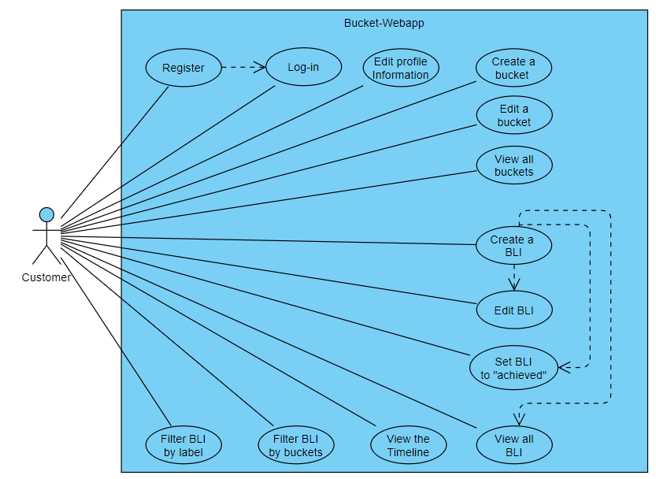
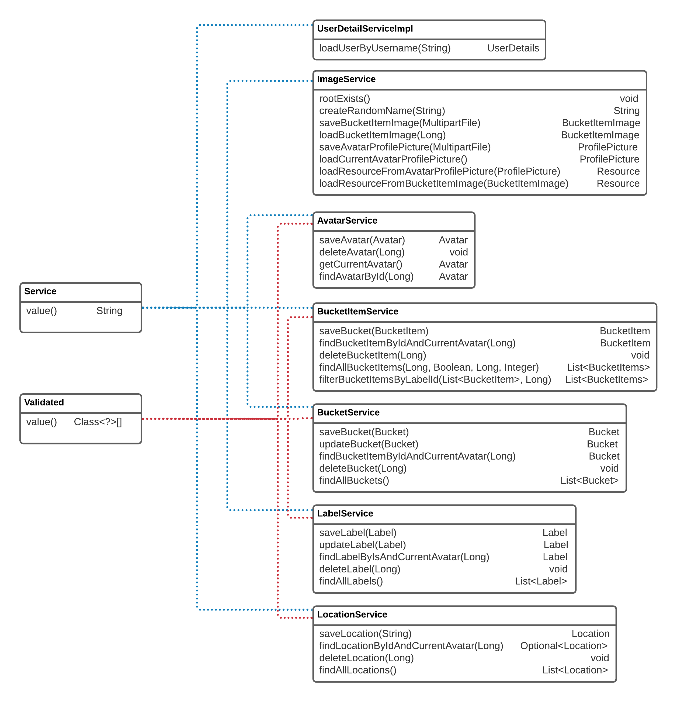

  

  
  Manage your bucket list in a modern web experience. 
  <a href="#introduction">Introduction</a> | <a href="https://github.com/mahgoh/bucket-frontend">Frontend Development</a> | <a href="https://bucket-webapp.herokuapp.com">Demo</a>

# Bucket Webapp

The Bucket web app was developed as a part of the Internet Technology module of the Business Information Technology study programme at FHNW by Flavio Filoni ([@ffiloni](https://github.com/ffiloni)), Tibor Haller ([@972C8](https://github.com/972C8)), Luca Herlig ([@luca-h1998](https://github.com/luca-h1998)) and Marco Kaufmann ([@mahgoh](https://github.com/mahgoh)). The app allows users to manage their personal bucket list and follow their achievements in a timeline over time.

The project was developed in two repositories: [bucket-webapp](https://github.com/972C8/bucket-webapp) and [bucket-frontend](https://github.com/mahgoh/bucket-frontend). `bucket-webapp` contains the main application and the final web application. The frontend was developed in the repository `bucket-frontend`, using a custom HTML bundler - more information about the bundler can be found in the repository.

## Introduction

This documentation describes the continuous development process/journey of our project. The goal of the project work was to create a full fledged-web application using a wide variety of software and tools introduced by the lecturers. Applying the acquired knowledge from the lectures was a major assistance to achieve the set module goals. As a team consisting of four students, every member contributed to the project by using their strongest skills and enhanced their weaker skills by working as a team and learning/training by doing.

#### Contents:

- [Analysis](#analysis)
  - [Scenario](#scenario)
  - [Explanation of Terms](#explanation-of-terms)
  - [Requirements](#requirements)
  - [User Stories](#user-stories)
  - [Use Case](#use-case)
- [Design](#design)
  - [Prototype Design](#prototype-design)
  - [Domain Design](#domain-design)
  - [Business Logic Design](#business-logic-design)
  - [Endpoint Design](#endpoint-design)
- [Implementation](#implementation)
  - [Backend Technology](#backend-technology)
  - [Frontend Technology](#frontend-technology)
- [Deployment](#deployment)
- [User Guide](#user-guide)
- [Project Management](#project-management)
  - [Roles](#roles)
  - [Milestones](#milestones)

## Analysis

### Scenario

One of the first major decisions we made as a group was the idea of an application for our project work. The team concurred to take the project further than a simple CRM web app in order to profit of an interesting project. We voted for the idea of making a Bucketlist application which was very unambiguously. The application allows a users to create an account where they can manage their personal Bucketlist items with their goals in the future. Furthermore, one core concept that gave reason for this project was the idea of a timeline that shows users a list of their accomplishments and by scrolling down the timeline they can travel backwards in time through their past achievements, giving them a sense of accomplishment.

The CRM template (https://github.com/DigiPR/acrm-webapp) provided by the lecturers served as basis of our program. We adjusted and changed the template accordingly to our visions to deliver a well designed result. We even went as far as creating a second repository dedicated to the front-end development (https://github.com/mahgoh/bucket-frontend.git).

By determining our goal for the project we set up the scene for the next step which is the definition of user stories regarding the Bucketlist application. The following explanation of terms provides a common basis for the discussions and explanations in the documentation.

### Explanation of Terms

During the project specific terms were used that are relevant to the bucket list tracker:

- **Avatar** is the name we gave our users. An avatar is equivalent to a user.
- **Bucket List Item (BLI)** can be a goal or achievement for the future that can be given a title, short description, Bucket (category), due date, image, location and labels.
- **Bucket** lets you define a certain category that a BLI belongs to. A Bucket could be something like travel, health, education, project or work and can be made recognizable with different colours and icons for different Buckets.
- **Labels** are similar to the idea of hashtags used by social media platforms like Instagram. You can label your BLIs applicable labels and even sort all of your BLIs to a certain or multiple labels.
- **Timeline** shows you all your accomplished BLIs in the order of the date that you completed it. The most recent accomplishment is at the top of your timeline and by scrolling down you travel backwards in time through your past achievements!
- **Dashboard** is the landing page of the application after a successful login. In the Dashboard you are presented with a UI that lets you create BLIs and look at all your BLIs and Buckets. The eye-catching feature of the Dashboard is the presentation of the BLIs to be achieved with the next upcoming BLI at the top, so you'll never miss your next goal.
- **Profile** provides you with all your personal credentials like your name, Email and profile picture. The password can be directly managed inside the profile credentials if it needs to be updated due to security reasons.

### Requirements

**Functional Requirements**

*Creating*
- must be able to create a new user account
- must be able to create new Buckets
- must be able to create new BLIs

*Reading*
- must be able to display existing user account credentials
- must be able to display existing Buckets with their attributes in a list
- must be able to display existing BLIs with their attributes in a list
- must be able to display and sort existing Buckets in a list, according to the Name attribute
- must be able to display and sort existing BLIs chronologically in a list
- must be able to filter and display existing BLIs according to Buckets or Labels
- must be able to select a single BLI to display its details

*Updating*
- must be able to update user account credentials (Name, Password and Picture)
- must be able to update Bucket attributes
- must be able to update BLI attributes
- must be able to update Timeline when further BLIs are achieved
- must be able to update Dashboard to show the chronologically pending BLI

*Deleting*
- must be able to delete Buckets
- must be able to delete BLIs

*Others*
- must be able to remember the password to stay logged-in when application is closed
- must be able to log-out of a logged-in account
- must be able to navigate to the homepage with one click
- must be able to navigate to the main pages from the homepage

**Non-Functional Requirements**

- user friendly navigation
- clear and structured UI design
- reactive UI design for PC and mobile devices
- fluent timeline to scroll through all achieved BLIs
- BLIs on the timeline are shown uniformly with the details of the BLIs
- uniform design and structure of all pages (Continuous Integrity (CI))

### User Stories

1. As a [user], I want to have a web app so that I can use it on different mobile devices and on desktop computers.
2. As a [user], I want to see a consistent visual appearance so that I can navigate easily, and it looks consistent.
3. As a [user], I want to use list views so that I can explore and read my business data.
4. As a [user], I want to use edit and create views so that I can maintain my data
5. As a [user], I want to create an account so that I can get access to the Web app.
6. As a [user], I want to log-in so that I can authenticate myself.
7. As a [user], I want to edit my profile so that my data is stored securely.

In addition to the minimal generic user stories, the following user stories were defined:

1. As a [user], I want to view a timeline of achieved BLI so that I can get an overview of my past achievements.
2. As a [user], I want to create, read, update, and delete BLI so that I can manage my bucket list.
3. As a [user], I want to add different data to my BLI so that I can further personalize my BLI.
4. As a [user], I want a dashboard as a starting page so that I have an overview and can easily access relevant pages.
5. As a [user], I want to create categories for my BLI so that I have my BLI organized.
6. As a [user], I want to be able to filter and sort my BLI so that I can get an overview.
7. As a [user], I want a detailed view of BLI so that I can read up on the details.
8. As a [user], I want a well-structured GUI so that I can easily find the pages I look for.

### Use Case

- UC-1 [Login on bucket-webapp]: Customers can log-in by entering an email address and password. As an extension, new customers may register first.
- UC-2 [Register on bucket-webapp]: Customers can register to get an account (profile) to access the bucket-webapp.
- UC-3 [Edit profile information]: Customers can edit their profile information, e.g. Email/password/name/profile picture.
- UC-4 [Create a Bucket]: Customers can create a bucket. They can choose a name, color and icon. These buckets can be edited/deleted.
- UC-5 [Create a BLI]: Customers can create a BLI. They can choose a title, description, bucket, date to accomplish, image, location and labels. 
- UC-6 [Edit/Delete BLI]: Customers can edited/delete their BLI.
- UC-7 [Change status]: Customers can set/change the status of the BLI accomplished with a given date accomplished.
- UC-8 [View BLI all at once]: Customers can view their BLI's all at once.
- UC-9 [View BLI on the timeline]: Customers can view their achieved BLI's on the timeline.
- UC-10 [Filter BLI by buckets]: Customers can view their BLI's filtered by buckets
- UC-11 [Filter BLI by labels]: Customers can view their BLI's filtered by labels.

## Design

### Prototype Design

After the Analysis we started with the prototype design. At first we only had the prototype design for the timeline and the dashboard. After the first designs were given we focused on the domain model and the business logic (including the API design). Simultaneously, we started to code the website according to our designs. During this phase we also designed the profile page and the page to add a new item. As stated before, this was done in a [second repository](https://github.com/mahgoh/bucket-frontend) for a more efficient development.

The assets (HTML, CSS, JavaScript, image and font files) has been exported and will be extended in the later during implementation with JavaScript, to build a dynamic website.

We used a method called brainwriting to gather ideas for certain designs of our interface. With this method the members of our group individually wrote down their ideas and presented them in a Microsoft Teams meeting to the team. The advantage of this method was that everyone of the team already had their ideas ready and thus we did not waste time to look for ideas but combined the presented ideas to create our design. We evaluated the collected ideas and democratically chose the best ones that were suitable for our project. With the inspiration taken from this particular prototype meeting we were ready to approach the next challenge, namely the domain design.

An example for the bucketlist timeline design written by hand:

An example for the dashboard design written by hand:

A first sketch of the timeline on a mobile device made in Adobe XD:

### Domain design

The domain model describes the domain objects / entities that are found in `ch.fhnw.bucket.data.domain`. Note that for clarity getters and setters are not included in the domain model.

Classes included:

- Avatar, which is our name for a User
- Bucket, which is a category
- Location, which is a text address displayed using the Google Maps API
- Label, which is used to label a BucketItem
- BucketItem, is at the core of the app. Avatars create bucket items of things they want to accomplish in the future. BucketItems hold many different data, and Bucket, Label, Location, and BucketItemImage can be assigned them.
- AbstractImage, is the abstract class from which two types of images are extended. ProfilePicture to upload a new profile picture for an avatar, and BucketItemImage to upload an image for a bucket item.

Key points include:

- The entity **AbstractImage** is an abstract class with inheritance to both BucketItemImage and ProfilePicture. They are used to store information about uploaded Images as profile pictures or images for bucket items.
- The entity **BucketItem** as the idea of bucket items (similar to todo items) is at the core of our bucket-webapp. Logically, many connections to this entity exist.
- The ManyToMany relationship between BucketItem and Label. BucketItemToLabel signals the intermediate table, according to the UML standard.

### Business Logic Design

Our application is composed of a total of 7 business services, which are mainly used to interact with the database through API calls. All services use the @Service tag, and five use the validated annotation. The business services which use the validated annotation, all have particular methods that have to use this annotation and not every method is required to use it. Special attention should be paid to "ImageService" as this service includes custom implementation to manage images (upload/store/retrieve using the API). Both profile pictures and bucket item images are handled with this service. Uploaded images are stored in the file system and a corresponding object is created and stored in the database with the relevant information to retrieve it.

This is depicted in the following Business Logic Design:

### Endpoint Design

The [Postman](https://www.postman.com/) API Platform was used for the endpoint design and during the implementation of the backend. Using Postman allowed us to create the API collaboratively and efficiently thanks to a synchronized workflow. Furthermore, Postman also allowed us to create the API documentation through an out-of-the-box, user-friendly, web-view of the API.

As a backup, the bucket-webapp-api repository (https://github.com/972C8/bucket-webapp-api) was created to automatically push API changes in Postman to Github.

**Please check out our endpoint design at https://documenter.getpostman.com/view/17679206/UVXerdXY for a user-friendly web-view of the API.**

## Implementation

### Backend Technology

The backend was initially based on a fork of https://github.com/DigiPR/acrm-webapp. The following excerpt is copied from acrm-webapp and explains the main project dependencies:

#### Dependencies according to the ACRM fork:

This Web application is relying on [Spring Boot](https://projects.spring.io/spring-boot) and the following dependencies:

- [Spring Boot](https://projects.spring.io/spring-boot)
- [Spring Web](https://docs.spring.io/spring/docs/current/spring-framework-reference/web.html)
- [Spring Data](https://projects.spring.io/spring-data)
- [Java Persistence API (JPA)](http://www.oracle.com/technetwork/java/javaee/tech/persistence-jsp-140049.html)
- [H2 Database Engine](https://www.h2database.com)
- [PostgreSQL](https://www.postgresql.org)

To bootstrap the application, the [Spring Initializr](https://start.spring.io/) has been used.

### Backend Implementation

The backend serves two main purposes: Provide an API endpoint the frontend can interact with, and interact with the database using custom business logic and through API calls by extension.

#### Domain Design:

Data classes were implemented according to the created [domain design](#domain-design) and are found under `ch.fhnw.bucket.data.domain`. Using JPA it was possible to dynamically create the database schema with the help of annotations, such as @Entity and @Id.
Furthermore, the relationship mapping was defined using JPA annotations such as @OneToOne, @OneToMany, @ManyToMany, etc. This means that there was no need to manually create a database as JPA automatically does the job for us when the annotations were used.

This example highlights the defined relationships using JPA. The @OneToOne/@OneToMany relationships from Avatar correspond to the domain model.

#### Support of Images (using Inheritance)

The support of uploading images both as profile pictures and for bucket items is enabled through a custom implementation that stores images in the file system and a corresponding object in the database, which holds the relevant information to retrieve the image.
The implementation employs inheritance through AbstractImage as the abstract superclass with BucketItemImage and ProfilePicture extending from it.

This is highlighted in the domain model and implemented accordingly. The abstract class AbstractImage holds the main attributes relevant to images (such as fileName, fileType and fileUrl) and the classes ProfilePicture and BucketItemImage extend it.

**Single table inheritance and discriminator:**

The image implementation uses single table inheritance and a discriminator column.
This effectively means that only a single table is created in the database (although there are 3 classes!) and that the discriminator is used
to determine which class the particular row belongs to. More information is found at https://en.wikibooks.org/wiki/Java_Persistence/Inheritance#Single_Table_Inheritance

**Storing of Images:**

Images are stored in the directory "/uploads" and a database entry is created for either BucketItem or ProfilePicture,
which holds the relevant information (fileName, fileType, fileUrl). When a GET request is sent, the entry is retrieved from
the database and the image is taken from the file system using this information.

Images can be both stored in the database and using the file system. The implementation initially stored the images in the database,
but due to compatibility issue when using PostgreSQL on Heroku and Oracle locally, it was decided to store images in the directory.

Read more about this issue in the [deployment section](#deployment).

#### Location (Google Maps API)

When creating a bucket item, a specific location can be added. For example: the location "Big Ben, London, England" can be added to the bucket item "Run a Marathon".

The location is added as regular text and uses the **Google Maps API** to display the location using an **embeded map**.

Example:

More information is found at: https://developers.google.com/maps/documentation/embed/get-started

#### API Endpoint

The [API Endpoints](#endpoint-design) are found under `ch.fhnw.bucket.api`. In the pursuit of clarity, a class was created for each data class that is touched (e.g. AvatarEndpoint, BucketEndpoint, LabelEndpoint, ...).

The API endpoints call the respective business services (found under `ch.fhnw.bucket.business.service`) to perform the called methods (such as creating, reading, updating, or deleting entities).

For each entity, a repository class (found under `ch.fhnw.bucket.data.repository`) was created to interact with the database. This is a functionality offered through JPA.

### Frontend Technology

The visual appearance of the frontend was developed in a separate repository ([bucket-frontend](https://github.com/mahgoh/bucket-frontend)) with the usage of a custom component-based HTML bundler - written in [Go](https://go.dev/) specifically for this project. More about how the bundler works and how to use it is mentioned in the repository.

#### Dependencies

- [Custom HTML bundler](https://github.com/mahgoh/bucket-frontend)
- [Tailwind CSS](https://tailwindcss.com) ([MIT License](https://github.com/tailwindlabs/tailwindcss/blob/master/LICENSE))
- [Tabler Icons](https://tabler-icons.io) ([MIT License](https://github.com/tabler/tabler-icons/blob/master/LICENSE))

### Frontend Implementation

The basic structure of the frontend is written in plain HTML. Without using a framework or library, the process of creating multiple HTML files can be tedeous and hard to keep consitent. To mitigate this issue, we created a custom HTML bundler that gives us the power of using components. As an example, let's have a look at the navigation. It is present on almost all views. So, if we'd like to make a change to the navigation, all views containing it would need to be adapted - manually. Our bundler solves this by allowing to extract the navigation into a separate file and then referencing this file. During the bundling process, these components are then loaded (recursively) and processed into a single HTML file. If we now change the navigation, we have to do this at only one place, reducing the inconsitent design and improving the development experience. The documentation in the [frontend repository](https://github.com/mahgoh/bucket-frontend) elaborates more in-depth how this process works.

#### Visual Appearance

The power of utility classes in CSS, especially, when working in a team is incredible. We use [Tailwind CSS](https://tailwindcss.com/) to make use of this and ensure a great collaboration and maintainability in the future. This means that we did not write a single line of CSS but used utility classes instead. This promises to lead to a more consistent visual appearance and easier collaboration and maintenance. To learn more about this approach and it's benefits read the [article](https://adamwathan.me/css-utility-classes-and-separation-of-concerns/) by Adam Wathan the creator of Tailwind CSS.

During development, the Tailwind CSS Play CDN is used - a just-in-time CDN in the browser. Once completed with the design, the Tailwind CSS CLI is used to create a CSS bundle with only the used utility classes.

Thanks to the component-based approach, the use of utility classes makes even more sense. Otherwise, there would be the chance that we'd had to rewrite the same elements over and over. If they have many utility classes, this can result in a loss of clarity. With the use of components, the readability is improved a lot and the utility classes describe precisely the appearance of the element.

#### Interactivity

In order to make the frontend interactive, JavaScript is used to make HTTP requests, manipulate the DOM, animate element and so on.

The required functions are all written from scratch without the help of any third-party library by using the available Web Standards. These functions are grouped into modules to logically combine them. The majority of these functions are located in `api.js` and `lib.js`. The former includes relevant functions to make requests to the API. The latter includes relevant functions to validate inputs, render templates, formatting values and much more. For an in-depth documentation on the different modules and their functions, visit the [JavaScript Modules Reference](https://github.com/mahgoh/bucket-frontend#javascript-modules-reference) in the frontend repository.

## Deployment

This project has been deployed to Heroku by using the pre-configuration scripts `app.json` and `Procfile`.
The project locally uses an in-memory database and PostgreSQL on Heroku, as it was added as an addon.

The deployment to Heroku is quite easy and the project was therefore quickly set up. After creating a new web app by giving it a name, it was only necessary to connect it to the Github repository. The project could then be deployed and was ready to go. Although no issue occured during the deploymenet, a bigger problem was found with the image upload in regards to compatibility with PostgreSQL. This issue is detailed in the next section.

The project is accessible at: https://bucket-webapp.herokuapp.com

### Issues during the deployment:

Deployment to Heroku was smooth. However, an issue arised with storing images.

**Source of the issue:** The project uses PostgreSQL on Heroku, but an in-memory (oracle) database locally.
Storing images directly in the datababe using the byte[] datatype and the @Lob annotation (to signify large objects)
is not supported out-of-the-box for the two different databases!

In other words, when using PostgreSQL on Heroku and Oracle locally, the hibernate annotation for byte[] is not compatible.

The problem is detailed at https://stackoverflow.com/questions/3677380/proper-hibernate-annotation-for-byte and
the solution is to either use the same database locally and remote, or create a custom dialect for PostgreSQL.

No simple solution existed and testing was difficult due to not being able to reproduce it locally
(no effective testing is possible when the local environment works even when it doesn't for remote).
Therefore, it was decided to use this time and implement a file system for uploading and retrieving images. This approach
is sensible and how it is usually done for websites as we also know from work experience in web development.
Using a file system took additional time, but was estimated to be worthwhile for both the future additions to the project
and as a learning experience.

## User Guide

This Web application can be accessed over the browser by using the following address: `https://bucket-webapp.herokuapp.com`.

## Project Management

### Roles

- Leader Backend: Tibor Haller
- Leader Frontend: Marco Kaufmann
- Frontend / Documentation: Luca Herlig
- Frontend / Documentation: Flavio Filoni

### Milestones

1. **Analysis**: Scenario ideation, use case analysis and user story writing.
2. **Prototype Design**: Creation of Bootstrap static web-design prototype.
3. **Domain Design**: Definition of domain model.
4. **Business Logic and API Design**: Definition of business logic and API.
5. **Data and API Implementation**: Implementation of data access and business logic layers, and API.
6. **Security and Frontend Implementation**: Integration of security framework and frontend realisation.
7. **Deployment**: Deployment of Web application on cloud infrastructure.

#### License

- [Apache License, Version 2.0](blob/master/LICENSE)\*\*\*\*
